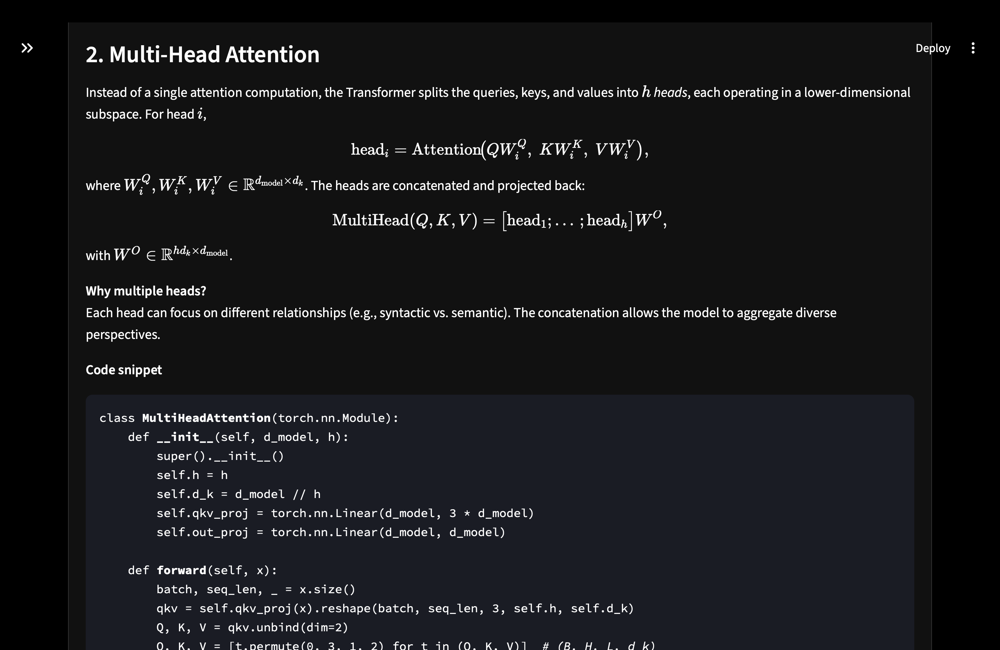
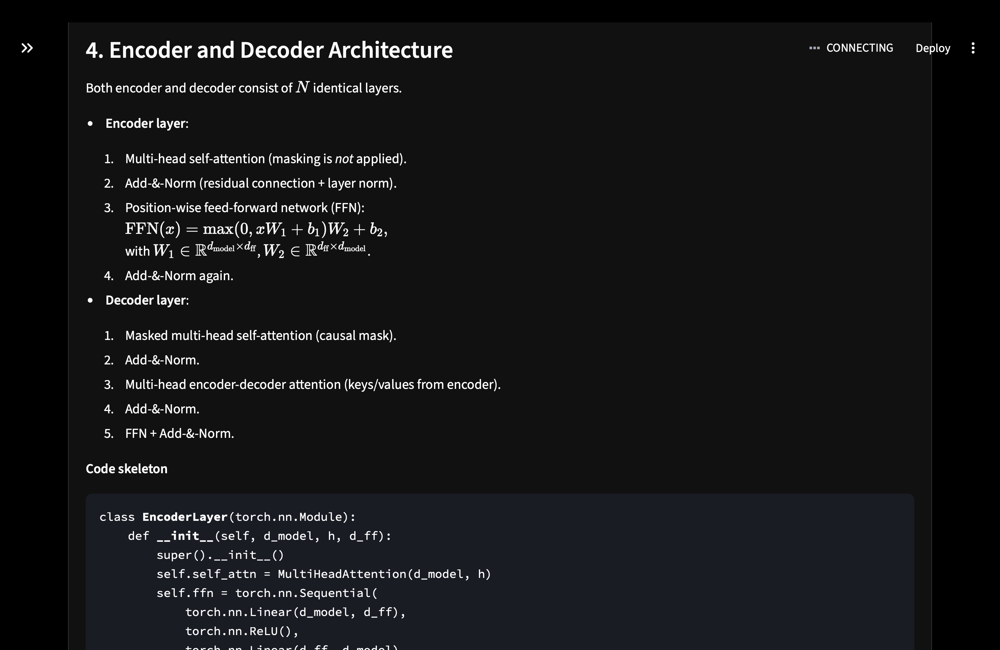

# 🧠 Axiom — AI Research Paper Summarizer

> A sleek, dark-mode Streamlit application powered by local LLMs (Ollama) to distill complex research papers into customizable summaries, complete with mathematical breakdowns, code snippets, and analogies.

[](#) 


## 🌍 Live Demo 
*Live deployment link coming soon!*

### Output Previews
Axiom provides beautifully formatted, LaTeX-rendered mathematical formulas and PyTorch code snippets inside a clean, distraction-free UI.

Here are a few examples of Axiom in action:

| **Processing & Sidebar** | **Multi-Head Attention (Math & Code)** | **LoRA (Math & Code)** |
|:---:|:---:|:---:|
|  |  |  |

*(Note: Please ensure your screenshot images are saved in the project folder with the corresponding filenames: `processing_sidebar.png`, `attention_math.png`, and `lora_math.png`.)*

---

## 🎯 What Axiom does

Reading machine learning and AI research papers can be daunting. Axiom is built to act as your personalized AI research assistant. By combining a custom Streamlit UI with LangChain and local Ollama models, Axiom allows you to:

- **Select popular research papers** (e.g., *Attention Is All You Need*, *LoRA*).
- **Customize the Output Style** (Beginner-Friendly, Technical, Code-Oriented, Mathematical).
- **Control the Length** (Short, Medium, Detailed).
- **Target Specific Focus Areas** (e.g., "explain the math with a concrete example").

The repository contains the main Streamlit application (`summ_gptoss20b.py`), the LangChain prompt template config (`template1.json`, generator `template.py`), and the necessary custom CSS for the deep-black UI embedded within the Python script.

---

## ✨ Highlights

- **Dynamic Markdown Rendering:** Flawlessly formats standalone and inline LaTeX equations.
- **Code-Oriented Explanations:** Automatically generates Python/PyTorch implementations of complex paper architectures.
- **Highly Customizable:** Prompt architecture dynamically adjusts the LLM's tone, verbosity, and focus based on user dropdowns.
- **Deep Dark Mode:** Custom CSS implementation overriding default Streamlit themes for a premium, sleek aesthetic.
- **Privacy-First & Local:** Runs entirely on your local machine or a private cloud instance using Ollama.

---

## 🚀 Quick start — Local

**Prerequisites**
- Python 3.8+
- Ollama installed and on PATH
- Minimum 16GB RAM (for running 20B parameter models, though you can adjust the model in code)
- `pip` or `conda` for environment management

**1) Install Ollama**
* Windows/macOS: Download from [ollama.com/download](https://ollama.com/download)
* Linux: `curl -fsSL https://ollama.com/install.sh | sh`

**2) Pull the Model**
```bash
# Pull the model used for this project (requires Ollama to be running)
ollama pull gpt-oss:20b
```
*(Note: If you want to use a different model like `llama3` or `mistral`, update the `model` parameter in `summ_gptoss20b.py`)*

**3) Clone the repository**
```bash
git clone <your-repository-url>
cd Axiom
```

**4) Install Dependencies**
```bash
pip install streamlit langchain-ollama langchain-core
```

**5) Run the App**
```bash
streamlit run summ_gptoss20b.py
```

## 🛠 Project Structure
- `summ_gptoss20b.py`: Main Streamlit application and UI definitions.
- `template.py`: Script to generate the LangChain prompt template.
- `template1.json`: Serialized LangChain prompt template.
- `README.md`: This documentation file.

## 📄 License
This project is licensed under the MIT License.
